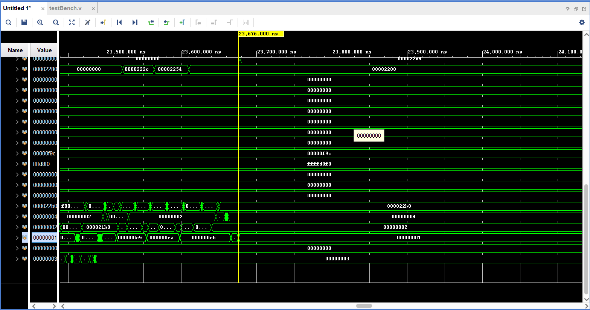
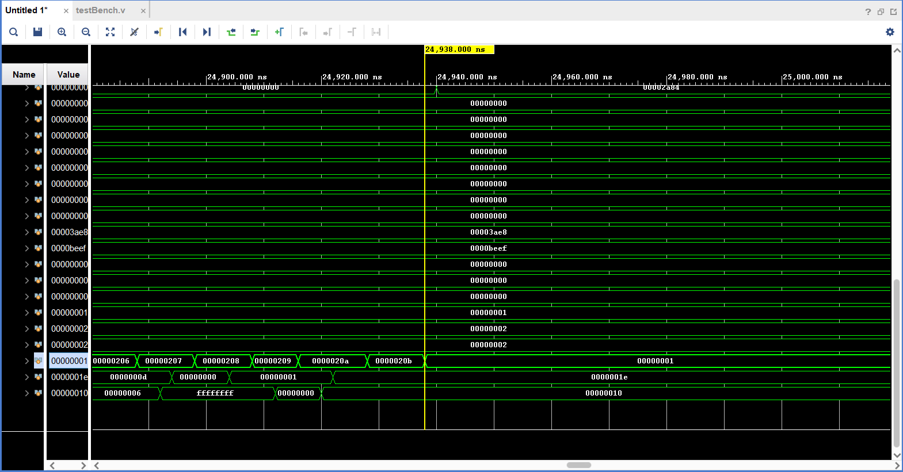
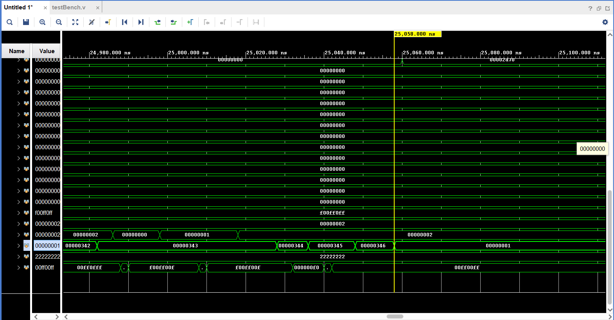
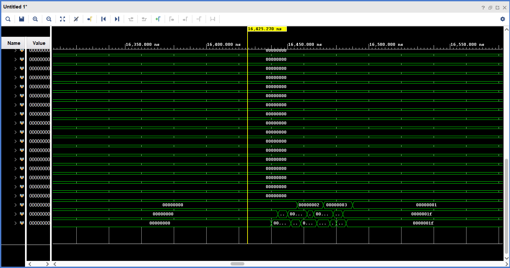

# Lab2 实验报告

PB20000072 王铖潇

## 实验目的

1. 掌握五级流水线CPU的设计方法
2. 熟悉RISC-V的指令集和数据通路，了解其设计背后的思想
3. 进一步提高使用verilog编码和调试的能力，学会使用仿真（Simulation）调试

## 实验内容

注：因为阶段一和阶段二需要做的工作比较相关，所以我在实验的过程中将两个阶段放在一起实现。

### 阶段一和阶段二

#### 实验目标

实现如下指令：

SLLI、SRLI、SRAI、ADD、SUB、SLL、SLT、SLTU、XOR、SRL、SRA、OR、AND、ADDI、SLTI、SLTIU、XORI、ORI、ANDI、LUI、AUIPC （阶段一）

 JALR、LB、LH、LW、LBU、LHU、SB、SH、SW、BEQ、BNE、BLT、BLTU、BGE、BGEU、JAL（阶段二）

阶段一和二的主要区别在于，阶段二需要考虑数据相关的情况。

#### 实验过程

1. `ALU.v`

   根据`ALU_func`对`op1`,`op2`进行操作，得到`ALU_out`.

2. `BranchDecision.v`

   根据`br_type`和`reg1`,`reg2`判断是否跳转，如果需要跳转那么控制信号`br=1`，否则`br=0`.

3. `ControllerDecoder.v`

   对指令进行译码。具体的信号的意义在代码注释中已经提供，只需要按照对指令的理解对它们赋值即可。

4. `DataExtend.v`

   针对load指令的不同类型，将load得到的数据扩展成32位。

   对于`Load Byte`类型指令，输入的`addr`是地址的最后两位，如果是0那么说明需要load的是该位置的字的最后一个字节，如果是1那么说明需要load的是该位置的字的倒数第二个字节，以此类推。将该字节单独取出，然后扩展到32位。如果LBU类型那么是无符号数，进行零扩展；LB是有符号数，进行符号位扩展。

   对于`Load Half`类型指令，地址的最后两位必须是2的倍数，只有可能是0或2。如果是0那么说明需要的是该位置的后半个字，如果是2那么说明需要的是该位置的前半个字。其余同理。

   对于`Load Word`类型指令，不需要额外的扩展操作。

5. `ImmExtend.v`

   对立即数进行扩展。

   根据输入的`imm_type`判断立即数的类型（根据指令类型确定），然后在官方手册中寻找该类型的指令中立即数的格式，将指令中的立即数扩展成32位即可。

6. `NPCGenerator.v`

   根据输入的`jalr`,`jal`,`br`控制信号，确定下一条指令的地址`NPC`.

   如果跳转信号都为0，那么不跳转，NPC是当前计算出的PC。

   如果`jalr`信号是1，那么NPC是`jalr_target`.对另外两个跳转信号的处理类似。

   需要注意的是跳转信号的优先级，需要先判断`jalr`和`br`是否为1再判断`jal`，因为`jal`的判断和跳转在ID段，而`jalr`和`br`的判断和跳转在EX段，如果它们同时为1，那么`jalr`或`br`应当是`jal`的前一条指令。

7. `Hazard.v`

   处理数据相关，生成各段的`bubble`和`flush`信号，以及操作数的选择信号`op1_sel`和`op2_sel`。

   1. `bubble`和`flush`

      如果有`br`或`jalr`的跳转信号，因为是EX段跳转，所以需要将前面的流水段（ID段和EX段）的控制信号停顿住，也就是flush置1.

      如果有`jal`的跳转信号，因为是ID段跳转，所以只需要将ID段控制信号停顿即可。

      如果存在相邻两条指令的RAW相关，也就是前面一条指令是`load`类型（判断的方法是`wb_select`是，重定向无法处理这种情况，需要增加一条空指令。这种相关是在ID段和EX段判断出来的，所以在ID段和EX段`bubble`置1，IF段`flush`置1表示停顿一个周期。

   2. `op1/op2_sel`

      如果EX段的源寄存器和MEM段的目的寄存器相同，并且MEM段在进行写入，且这个要读的寄存器不是`r0`(否则可以直接读），则说明在修改该寄存器的值，需要将该寄存器从MEM段直接重定向到EX段。
      
      如果EX段的源寄存器和WB段的目的寄存器相同，同理，从WB段重定向到EX段。
      
      否则从寄存器堆里取源寄存器。
      
      
   

#### 实验结果

三个测试样例的仿真结果如下：

`gp`寄存器的结果是1，说明通过全部的测试样例。

### 阶段三

#### 实验目标

实现CSR指令： CSRRW、CSRRS、CSRRC、CSRRWI、CSRRSI、CSRRCI

#### 实验过程

1. `CSR_EX.v`

   将CSR寄存器的值从ID段传递到EX段，和其他的段间寄存器操作类似。

2. `CSR_Regfile.v`

   和`GeneralRegister.v`相似，先对寄存器进行初始化，在`rst`信号时清零，在时钟上升沿到来时写数据，始终都可以读数据。

3. 补充`ALU.v`

   增加`ALU_func`的类型。

   `CSRRC`指令需要源通用寄存器中为1的位在CSR中所对应的位会被清零，用到的操作是`ALU_out = ~op1 & op2`；

   `CSRRS`指令源通用寄存器中所有为1的位所对应的CSR中的那一位都会被写1，用到的`OR`指令原先就存在；

   `CSRRWI`指令需要将源通用寄存器的值存入目的CSR，需要用到的操作是`ALU_out = op1`.

4. 补充`ControllerDecoder.v`

   对CSR指令相关也需要进行译码。

   对于读到的CSR指令，需要判断送给ALU的第一个源操作数是来自寄存器还是立即数，同时根据不同的指令对`ALU_func`赋不同的值。

#### 实验结果

`gp`寄存器的结果是1，说明通过全部的测试样例。

## 实验难点

本次实验在调试过程中遇到的困难有：

1. `auipc`的处理。

   一开始的想法是要在ALU中单独给它一个`ALU_func`，后来发现取高20位的操作在`ImmExtend.v`里面实现，ALU中只要使用ADD即可。

2. 算数右移指令`ASR`的处理。

   一开始使用`>>>`进行算数右移，但是发现右移之后的数还是在高位补0，而不是期望的补符号位。经过查阅资料发现，应当对需要右移的数做`signed()`处理，否则会默认是无符号数。

3. Hazard模块中`wb_select`信号的来源。

   一开始认为是来自WB段的信号，所以对如何利用它判断RAW相关非常迷惑。后来阅读`RV32ICore.v`代码发现对这个模块的调用中和该接口有关的语句是`.wb_select(wb_select_EX),`,也就是说使用的是EX段的信号。

4. CSRRC指令“源通用寄存器中为1的位在CSR中所对应的位会被清零”的处理。

   一开始没有想到如何用ALU中的算数指令实现。

5. CSR类指令整体的实现。

   一开始根据官方文档，以为要将一条指令拆成两条来做。但是流水线的框架中显然没有提供这种做法。我经过阅读`RV32ICore.v`的代码理解了相关操作。

## 实验时间

阶段1和2：共一天（约8小时）。

阶段3：半天（约3小时）。其中读懂`RV32ICore.v`代码花费了较多时间。

实验报告：2小时。

## 实验收获

经过本次实验，我对流水线CPU有了更深入的理解。同时也初步复习了verilog的写法。另外，实验框架比较详细，让我的体验感比较良好，也终于不畏惧写verilog代码了！

## 改进意见

希望可以有更详细的实验文档。比如我一开始没有看到`Parameters.v`文件，自己对照实验代码逐个给参数写宏定义，花费了较多不必要的精力。

另外，希望`ControllerDecoder.v`里的一些信号的取值也可以写成宏定义的形式，而不仅仅是注释的形式。这样可以便于后面的代码编写。
