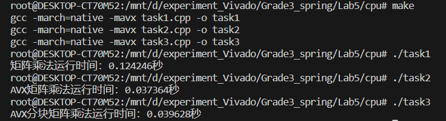
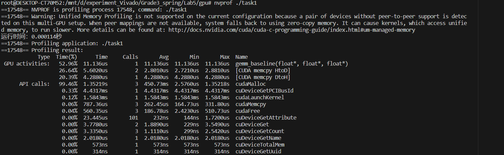
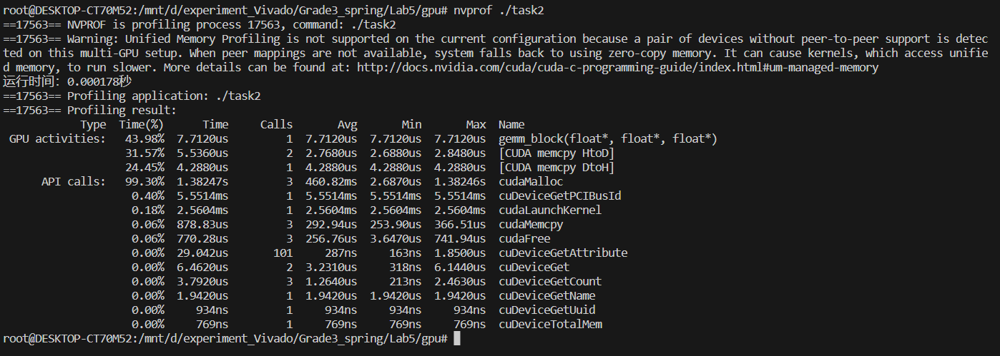
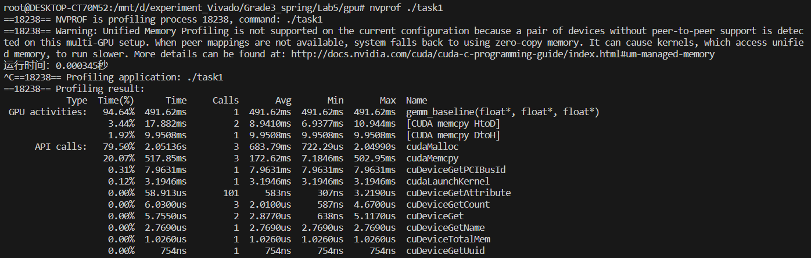
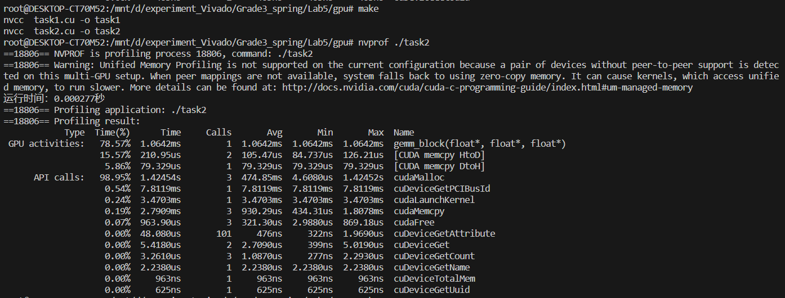

# Lab5 实验报告

PB20000072 王铖潇

## CPU

基础矩阵乘法，AVX矩阵乘法和AVX分块矩阵乘法的实现分别为`task1.cpp`, `task2.cpp`, `task3.cpp`.

### 三种实现性能的差异

对不同规模的输入，三种实现的矩阵乘法用时如下表。其中AVX分块矩阵乘法中块大小是$8*8$.

| 矩阵大小        | 基础矩阵乘法用时(s) | AVX矩阵乘法用时(s) | AVX分块矩阵乘法用时(s) |
| --------------- | ------------------- | ------------------ | ---------------------- |
| $2^6*2^6$       | 0.004380            | 0.000987           | 0.001000               |
| $2^8*2^8$       | 0.1242              | 0.0374             | 0.0396                 |
| $2^9*2^9$       | 0.7840              | 0.1695             | 0.1913                 |
| $2^{10}*2^{10}$ | 14.0048             | 2.8428             | 1.9222                 |
| $2^{11}*2^{11}$ | 213.3354            | 36.8003            | 16.1930                |

对于64*64的矩阵，截图如下：

可以发现，使用AVX的两种方法性能明显好于基础矩阵乘法。但是AVX矩阵乘法和AVX分块矩阵乘法的性能和矩阵大小有关，当矩阵比较小的时候，AVX矩阵乘法和AVX分块矩阵乘法的性能相差不大，甚至AVX矩阵乘法的性能更好；但是矩阵规模较大的时候，AVX分块矩阵乘法的性能明显好于AVX矩阵乘法。

分析：使用AVX的方法性能明显好于基础的矩阵乘法是因为它们使用了并行化处理，可以大幅度缩短时间。AVX分块矩阵乘法虽然可以利用cache的局部性实现加速，但是分块的预处理本身也需要时间，所以当矩阵规模较小的时候，使用分块方法的优化效果并不明显，甚至可能由于预处理时间较长反而性能变差；但是当矩阵规模较大的时候，分块方法对cache局部性应用得更充分，有很明显的优化效果。

### 不同的分块参数对AVX分块矩阵乘法性能的影响

选择矩阵大小为$2^{10}*2^{10}$，不同的分块参数下，矩阵乘法用时如下表：

| 块大小    | 用时(s) |
| --------- | ------- |
| $8*8$     | 1.6983  |
| $16*16$   | 1.6645  |
| $32*32$   | 1.4481  |
| $64*64$   | 1.2247  |
| $128*128$ | 1.4875  |
| $256*256$ | 1.4520  |

可以发现，分块大小太小或者太大都会似的用时较长。

分块比较小的时候，可以充分利用cache的局部性，但循环次数较多，而每次循环前后都需要进行分块或是合并的处理。分块比较大的时候，不能很好地利用cache局部性。所以需要权衡二者，取一个合适的分块大小，才能获得更好的性能。

### CPU平台上其它矩阵乘法的优化手段

1. 循环重排序

   调整三层循环中内两层循环的顺序，保证访问矩阵的空间局部性。

2. 循环展开

   直接对汇编生成的代码进行循环展开，减少流水线处理时的停顿。

3. 写缓存优化

   开一块write cache内存空间，每个block的计算结果直接在write cache上读写，最后计算完一个block之后，整块写回目标数组中对应的不同数组段上。

4. 算法优化

   对于较大规模的矩阵，优化算法、降低算法的时间复杂度也会对性能产生较大的提示。如Strassen算法或Winograd算法等。

## GPU

基础矩阵乘法，分块矩阵乘法的实现分别为`task1.cpp`, `task2.cpp`.

### 两种实现性能的差异

对不同规模的输入，两种实现的矩阵乘法用时如下表。其中分块矩阵乘法中块大小是$8*8$.

| 矩阵大小        | 基础矩阵乘法用时(ms) | 分块矩阵乘法用时(ms) |
| --------------- | -------------------- | -------------------- |
| $2^6*2^6$       | 0.011136             | 0.007120             |
| $2^8*2^8$       | 0.47824              | 0.27859              |
| $2^9*2^9$       | 4.5099               | 2.6704               |
| $2^{10}*2^{10}$ | 35.948               | 21.688               |
| $2^{11}*2^{11}$ | 306.79               |                      |

矩阵大小为$2^6*2^6$时，使用`nvprof`工具对矩阵乘法kernel的时间进行profiling，截图如下：

GPU上，分块矩阵乘法用时短于基础矩阵乘法。

这是因为分块矩阵乘法利用了访存更快的`shared memory`，效率更高。

### 不同的`gridsize`和`blocksize`对基础矩阵乘法性能的影响

`gridsize`根据`blocksize`而变化。这里改变`blocksize`，对性能的影响如下表。矩阵规模是$64*64$.

| blocksize | 用时(us) |
| --------- | -------- |
| $4*4$     | 1234.6   |
| $8*8$     | 710.05   |
| $16*16$   | 480.04   |
| $32*32$   | 493.96   |

`blocksize`为$8*8$的时候，使用`nvprof`工具对矩阵乘法kernel的时间进行profiling，截图如下：

可以看出，`blocksize`过小或是过大都会对性能产生负面影响。

`blocksize`增加时，一方面增加了一次性处理的数据数量，但另一方面也可能超出硬件设备支持的范畴，导致部分操作退化为串行处理从而导致性能下降。所以需要权衡，找到一个合适的`blocksize`.

### 不同的`gridsize`和`blocksize`对分块矩阵乘法性能的影响

`gridsize`根据`blocksize`而变化。这里改变`blocksize`，对性能的影响如下表。矩阵规模是$64*64$.

| blocksize | 用时(us) |
| --------- | -------- |
| $4*4$     | 1064.2   |
| $8*8$     | 278.02   |
| $16*16$   | 233.73   |
| $32*32$   | 227.52   |

`Block`大小为$8*8$的时候，使用`nvprof`工具对矩阵乘法kernel的时间进行profiling，截图如下：

可以看出，`BLOCK`的大小增加时性能上升。

可能是因为BLOCK大小增加时，分块后一次性处理的数据更多，减少了每次分块前后的处理时间。

